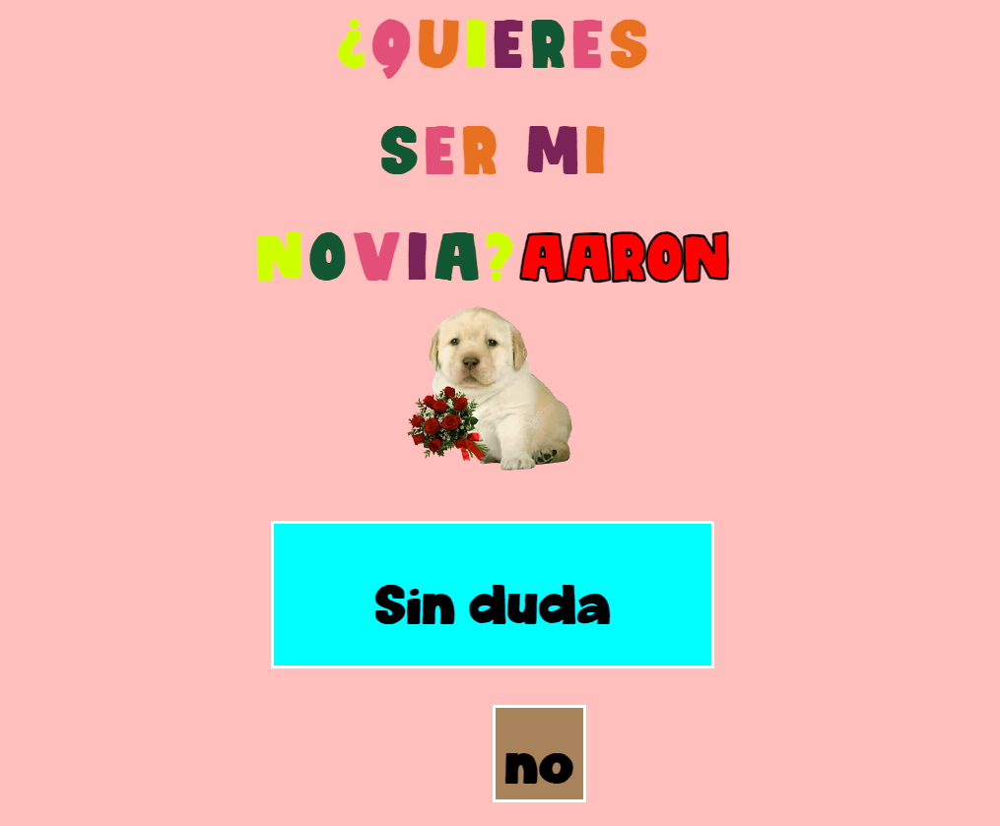

# ¿Quieres ser mi San Valentín? HTML, CSS y JS

## Opciones de Uso
- **Opción Uno:** Simplemente ingresa aquí y disfruta de la experiencia
- **Opción Dos:** Descarga el archivo ZIP directamente desde GitHub en Android o PC (no necesitas internet)
- **Opción Tres:** Descargar código para explorar y utilizar el proyecto en tu propia máquina

## Novedad para el 14 de Febrero
En esta versión especial, ahora puedes expresar tus sentimientos a esa persona especial. Solo hay dos botones, uno para "SÍ" y otro para "NO". Sin embargo, hay un giro interesante: el botón "NO" siempre se mueve aleatoriamente en la pantalla, haciendo que sea imposible rechazar tu propuesta.

## Funciones Principales
- Al inicio, solicita el nombre de la persona y lo muestra en pantalla.
- Diseño de interfaz inspirado en el meme del cartel con sonido de banda de fondo.
- Proyecto responsivo, adaptable tanto para dispositivos móviles como para computadoras.

**Sigue en Contacto:**
Me puedes encontrar en todas las redes sociales como [@srjosueaaron](URL_SOCIAL_MEDIA)!

Te deseo la mejor de las suertes! Espero que esa persona pueda valorar todo tu esfuerzo; de lo contrario, llegará alguien más indicado en el momento adecuado 💖

**Agradecimientos:**
Este proyecto se inspira en la creatividad de varios tutoriales encontrados en YouTube. Aquí están los videos en los que me basé:
1. [Enlace al Video 1](URL_DEL_VIDEO_1)
2. [Enlace al Video 2](URL_DEL_VIDEO_2)